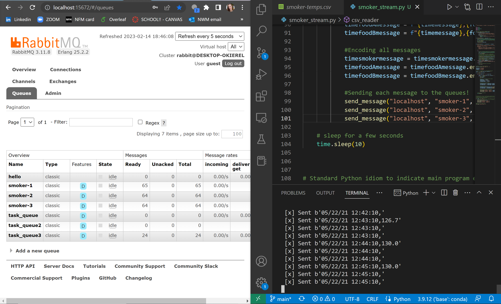

# streaming-05-smart-smoker

This python program takes in a 4 column csv where the first column is a timestamp. The following three columns are temperature columns. This program can take in as many rows as the file has just put the csv file name into the bottom row of the code!

# Here is the photo of my program running!

