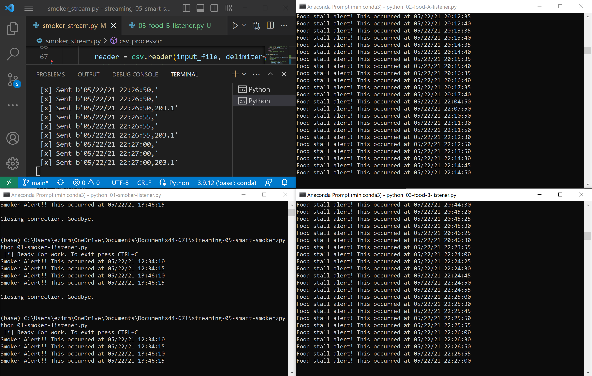

# streaming-05-smart-smoker

This python program takes in a 4 column csv where the first column is a timestamp. The following three columns are temperature columns. This program can take in as many rows as the file has just put the csv file name into the bottom row of the code! 

There are three consumer files that will check to see if there has been certain temperature changes. Run them to see if you have any concerning changes!

# Here is the photo of my program running!

# Here is a photo of all four screens running

